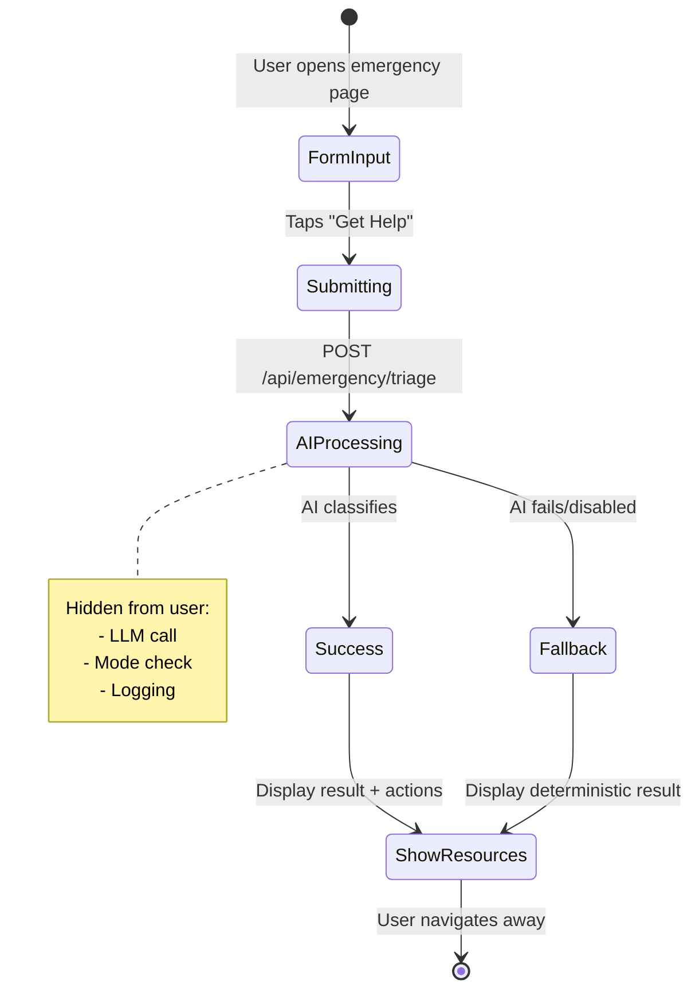
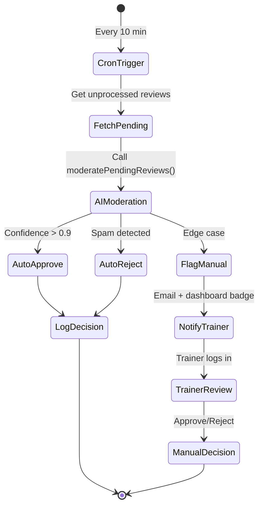

# User Workflow Design Guide – Dog Trainers Directory

**Priority:** Mobile-First | **Context:** Complex AI Automation Backend

---

## 🎯 Core Design Philosophy

### Principle 1: **Hide Complexity, Surface Intent**

Users don't care about AI pipelines, cron jobs, or shadow mode. They care about:
- "Is my emergency request being handled?"
- "When will my review be approved?"
- "Is my featured placement active?"

**Design Implication:** Every UI screen should answer **one user question**, not expose system internals.

---

### Principle 2: **Mobile-First = Thumb-First**

80% of users will access DTD on phones during high-stress moments (dog emergency, finding a trainer urgently).

**Design Constraints:**
- All primary actions within **thumb reach** (bottom 50% of screen)
- No horizontal scrolling
- Large tap targets (min 44×44px)
- Progressive disclosure (hide advanced options)

---

### Principle 3: **Automation = Invisible Until Broken**

AI should work silently. Only surface manual intervention when:
1. AI flags something for human review
2. User explicitly requests manual override
3. System is in degraded state (AI disabled)

**UI Pattern:** "Trust indicators" instead of "status panels"
- ✅ Green badge: "Auto-processing"
- ⚠️ Yellow badge: "Review needed"
- 🔴 Red badge: "Action required"

---

## 📱 User Personas & Workflows

### Persona 1: **Dog Owner (Emergency)**

**Context:** Dog injured, panicking, needs help NOW.

#### Workflow: Submit Emergency Triage
```
[Mobile Screen 1: Emergency Form]
┌─────────────────────────────────┐
│ 🐕 What's wrong with your dog?  │
│                                 │
│ [Large Text Area]               │
│ "My dog is bleeding from..."    │
│                                 │
│ ┌─────────────────────────────┐ │
│ │   📸 Add Photo (optional)   │ │ ← Bottom 30% = Thumb zone
│ └─────────────────────────────┘ │
│ ┌─────────────────────────────┐ │
│ │   🚨 GET HELP NOW           │ │ ← CTA: Large, high contrast
│ └─────────────────────────────┘ │
└─────────────────────────────────┘

[Mobile Screen 2: AI Classification (Immediate)]
┌─────────────────────────────────┐
│ ✅ We've classified your case   │
│                                 │
│ 🏥 MEDICAL EMERGENCY            │ ← AI result, hidden complexity
│                                 │
│ Recommended action:             │
│ • Call vet immediately          │
│ • See emergency resources ↓     │
│                                 │
│ ┌─────────────────────────────┐ │
│ │   📞 Call Emergency Vet     │ │
│ └─────────────────────────────┘ │
│ ┌─────────────────────────────┐ │
│ │   📍 Find Nearest Clinic    │ │
│ └─────────────────────────────┘ │
│                                 │
│ Reference ID: #TR-12345         │ ← For follow-up
└─────────────────────────────────┘
```

**What AI Does (Hidden):**
- `classifyEmergency()` runs instantly
- Logs to `emergency_triage_logs` with `decision_source='llm'`
- If AI is disabled, deterministic fallback applies (user sees no difference)

**Error Handling:**
- If AI fails → show deterministic result immediately
- If API fails → queue request, show "We're processing this, check back in 5 min"
- Never show technical errors to user

---

### Persona 2: **Trainer (Review Management)**

**Context:** Trainer checks reviews during coffee break, wants quick moderation.

#### Workflow: Review Posted Review
```
[Mobile Screen: Trainer Dashboard]
┌─────────────────────────────────┐
│ Your Reviews (3 pending)        │
│                                 │
│ ┌─────────────────────────────┐ │
│ │ ⚠️ Review flagged by AI     │ │ ← AI decision visible
│ │                             │ │
│ │ "Great trainer but..."      │ │
│ │ — Sarah M. (2h ago)         │ │
│ │                             │ │
│ │ [View Full Review →]        │ │
│ └─────────────────────────────┘ │
│                                 │
│ ┌─────────────────────────────┐ │
│ │ ✅ Auto-approved (12 today) │ │ ← Trust indicator
│ └─────────────────────────────┘ │
└─────────────────────────────────┘

[Mobile Screen: Review Detail]
┌─────────────────────────────────┐
│ ← Back                          │
│                                 │
│ Review from Sarah M.            │
│ Posted 2h ago                   │
│                                 │
│ "Great trainer but the facility │
│ smelled bad. Would not reco..." │
│                                 │
│ ⚠️ AI flagged: Negative tone   │ ← Context from AI
│                                 │
│ ┌─────────────────────────────┐ │
│ │   ✅ Approve Anyway         │ │
│ └─────────────────────────────┘ │
│ ┌─────────────────────────────┐ │
│ │   🚫 Reject (Spam)          │ │
│ └─────────────────────────────┘ │
│ ┌─────────────────────────────┐ │
│ │   ⏸️  Review Later          │ │
│ └─────────────────────────────┘ │
└─────────────────────────────────┘
```

**What AI Does (Hidden):**
- Moderation cron runs every 10 min
- Auto-approves clean reviews (`decision_source='llm'`)
- Flags edge cases for manual review
- Trainer only sees flagged items (noise reduction)

**Progressive Disclosure:**
- Default: Show only "flagged" count
- Tap "Auto-approved" → Expand to show list (for curiosity/audit)

---

### Persona 3: **Admin (Operations Monitor)**

**Context:** Solo operator, 5-minute daily check, mobile-first.

#### Workflow: Daily Health Check
```
[Mobile Screen: Admin Dashboard]
┌─────────────────────────────────┐
│ Admin Dashboard                 │
│                                 │
│ ┌─────────────────────────────┐ │
│ │ All Systems Healthy ✅      │ │ ← Summary status
│ └─────────────────────────────┘ │
│                                 │
│ Today's Activity:               │
│ • 47 reviews auto-processed     │
│ • 3 emergencies triaged         │
│ • 1 featured placement expired  │
│                                 │
│ ┌─────────────────────────────┐ │
│ │   View AI Health →          │ │
│ └─────────────────────────────┘ │
│ ┌─────────────────────────────┐ │
│ │   View Cron Jobs →          │ │
│ └─────────────────────────────┘ │
│                                 │
│ Quick Actions:                  │
│ ┌───────────────┬─────────────┐ │
│ │ Run Moderation│ Expire Feat.│ │ ← Thumb-accessible
│ └───────────────┴─────────────┘ │
└─────────────────────────────────┘

[Mobile Screen: AI Health (Drill-down)]
┌─────────────────────────────────┐
│ ← Back to Dashboard             │
│                                 │
│ AI Pipeline Health              │
│                                 │
│ ┌─────────────────────────────┐ │
│ │ Triage        ✅ Live       │ │
│ │ 12 decisions (100% AI)      │ │
│ │ Last run: 5m ago            │ │
│ └─────────────────────────────┘ │
│                                 │
│ ┌─────────────────────────────┐ │
│ │ Moderation    ✅ Live       │ │
│ │ 47 reviews (94% auto)       │ │
│ │ Last run: 2m ago            │ │
│ └─────────────────────────────┘ │
│                                 │
│ ⚠️ Warning: No issues detected  │
│                                 │
│ [Emergency: Disable All AI →]   │ ← Kill-switch, low priority
└─────────────────────────────────┘
```

**Design Decisions:**
- **Status-first:** Green badge = no action needed
- **Progressive disclosure:** Drill-down for details, summary on top
- **Rare actions at bottom:** Kill-switch below fold (prevents accidents)

---

## 🏗️ Mobile-First UI Architecture

### Component Hierarchy

```
App Shell (Always Visible)
├── Top Bar (thin, status only)
│   ├── Logo / Back Button
│   └── Notification Badge (red dot)
├── Main Content (80% of screen)
│   └── Role-specific dashboard
└── Bottom Nav (44px height, thumb zone)
    ├── Home
    ├── Activity
    ├── Profile
    └── Admin (if role = admin)
```

### State Management Pattern

**Use Server Components + React Server Actions** (Next.js App Router)

Why?
- Reduces client-side JS (faster on mobile)
- Automatic revalidation (fresh data on navigation)
- Works offline with `next/cache` + service workers

```typescript
// Example: Trainer Dashboard (src/app/trainer/reviews/page.tsx)
export default async function TrainerReviewsPage() {
  // Server-side data fetch (zero client JS)
  const flaggedReviews = await getFlaggedReviews()
  const autoApprovedCount = await getAutoApprovedCount()

  return (
    <div>
      <h1>Your Reviews</h1>
      {flaggedReviews.length > 0 ? (
        <FlaggedList reviews={flaggedReviews} />
      ) : (
        <EmptyState message="No reviews need attention!" />
      )}
      
      {/* Progressive disclosure */}
      <Accordion>
        <AccordionItem title={`✅ Auto-approved (${autoApprovedCount})`}>
          <AutoApprovedList /> {/* Lazy-loaded */}
        </AccordionItem>
      </Accordion>
    </div>
  )
}
```

---

### Offline-First Strategy

**Critical for mobile (spotty connections):**

1. **Optimistic UI:**
   - Button tap → immediate feedback (disable button, show spinner)
   - Background: POST to API
   - On failure: rollback + toast error

2. **Service Worker Caching:**
   - Cache static assets (logo, icons)
   - Cache recent dashboard data (5 min TTL)
   - Queue mutations (POST requests) if offline

3. **Skeleton Screens:**
   - Never show blank screen on slow connection
   - Show layout immediately, stream data

```typescript
// Example: Optimistic approve action (src/components/ReviewActions.tsx)
'use client'

export function ApproveButton({ reviewId }: { reviewId: string }) {
  const [isPending, startTransition] = useTransition()

  const handleApprove = () => {
    startTransition(async () => {
      // Optimistic update
      toast.success('Review approved!')
      
      // Background mutation
      const result = await approveReview(reviewId)
      
      if (!result.success) {
        // Rollback
        toast.error('Approval failed, please retry')
      }
    })
  }

  return (
    <button onClick={handleApprove} disabled={isPending}>
      {isPending ? 'Approving...' : '✅ Approve'}
    </button>
  )
}
```

---

## 🎨 Visual Design Patterns

### 1. **Trust Indicators** (Replace Status Tables)

❌ **Bad:** Show all AI metadata
```
Decision Source: llm
AI Provider: openai
Model: gpt-4
Confidence: 0.87
Mode: live
```

✅ **Good:** Show outcome only
```
✅ Auto-processed by AI
```

On tap → Expand details (for power users)

---

### 2. **Action Hierarchy** (Mobile Touch Targets)

```
Primary Action (Full width, high contrast)
┌─────────────────────────────────┐
│   🚨 GET HELP NOW (56px)        │ ← Large, unmissable
└─────────────────────────────────┘

Secondary Action (Outline, medium)
┌─────────────────────────────────┐
│   📞 Call Vet (48px)            │
└─────────────────────────────────┘

Tertiary Action (Text link, small)
──────────────────────────────────
  View More Details →
──────────────────────────────────
```

**Thumb Zone Map:**
- Bottom 30%: Primary CTAs
- Middle 40%: Content (scrollable)
- Top 30%: Navigation, secondary actions

---

### 3. **Error States** (Fail Gracefully)

**AI Disabled Scenario:**

```
[Emergency Form Submission]
┌─────────────────────────────────┐
│ ⚠️  AI Classification Unavail. │
│                                 │
│ We've used rule-based matching  │
│ to classify your case.          │
│                                 │
│ 🏥 Likely: MEDICAL EMERGENCY    │
│                                 │
│ [Proceed to Resources →]        │
└─────────────────────────────────┘
```

**User never sees:** "LLM API timeout", "Shadow mode active", etc.

---

## 🔄 User Workflow State Machines

### Emergency Triage Flow



**UI Implementation:**
- States = React Server Actions (no client-side state machine)
- Loading state = Suspense boundary
- Error state = Error boundary (fallback UI)

---

### Review Moderation Flow



**UI Touchpoints:**
1. Trainer never sees cron (hidden)
2. Trainer sees notification: "3 reviews need attention"
3. Trainer taps → sees flagged reviews only
4. Manual decision → logs with `decision_source='manual_override'`

---

## 📐 Responsive Breakpoints

**Mobile-First Cascade:**

```css
/* Base: Mobile (320px+) */
.dashboard {
  padding: 16px;
  font-size: 16px; /* Avoid zoom on iOS */
}

.cta-button {
  width: 100%;
  height: 56px; /* Large tap target */
}

/* Tablet (768px+) */
@media (min-width: 768px) {
  .dashboard {
    padding: 24px;
  }
  
  .cta-button {
    width: auto;
    min-width: 200px;
  }
}

/* Desktop (1024px+) - Admin Only */
@media (min-width: 1024px) {
  .admin-dashboard {
    display: grid;
    grid-template-columns: 1fr 1fr;
  }
  
  .cta-button {
    height: 48px; /* Smaller on desktop (mouse) */
  }
}
```

**Key Rule:** Never design desktop-first and "squeeze" to mobile. Start at 375px (iPhone SE) and expand upward.

---

## 🧪 Testing User Workflows (Mobile-First)

### 1. **Playwright E2E Tests** (Real Devices)

```typescript
// tests/e2e/emergency-triage.mobile.spec.ts
import { test, expect, devices } from '@playwright/test'

test.use({
  ...devices['iPhone 13'],
  geolocation: { latitude: -33.8688, longitude: 151.2093 }, // Sydney
  permissions: ['geolocation']
})

test('Emergency triage flow (mobile)', async ({ page }) => {
  await page.goto('/emergency')
  
  // Verify large tap targets
  const ctaButton = page.locator('button:has-text("GET HELP NOW")')
  await expect(ctaButton).toHaveCSS('height', '56px')
  
  // Fill form
  await page.fill('textarea', 'My dog is bleeding from the leg')
  await ctaButton.click()
  
  // Verify immediate feedback (loading state)
  await expect(page.locator('text=Processing...')).toBeVisible()
  
  // Verify result (AI or fallback, user doesn't care)
  await expect(page.locator('text=MEDICAL EMERGENCY')).toBeVisible({ timeout: 5000 })
  
  // Verify next actions are in thumb zone
  const callButton = page.locator('button:has-text("Call Emergency Vet")')
  const box = await callButton.boundingBox()
  const viewportHeight = page.viewportSize()!.height
  
  // Bottom 50% = thumb zone
  expect(box!.y).toBeGreaterThan(viewportHeight * 0.5)
})
```

### 2. **Accessibility Tests** (Mobile Screen Readers)

```typescript
// tests/a11y/emergency.mobile.spec.ts
test('Emergency form is accessible (VoiceOver)', async ({ page }) => {
  await page.goto('/emergency')
  
  // Verify ARIA labels
  const textarea = page.locator('textarea')
  await expect(textarea).toHaveAttribute('aria-label', 'Describe your dog emergency')
  
  // Verify focus order (keyboard nav on iOS)
  await page.keyboard.press('Tab')
  await expect(textarea).toBeFocused()
  
  await page.keyboard.press('Tab')
  const ctaButton = page.locator('button:has-text("GET HELP NOW")')
  await expect(ctaButton).toBeFocused()
})
```

---

## 🚀 Implementation Roadmap

### Phase 1: **Core Mobile Flows** (Week 1-2)
- [ ] Emergency triage form (mobile-optimized)
- [ ] Trainer review dashboard (flagged items only)
- [ ] Admin health dashboard (summary view)
- [ ] Bottom navigation (role-aware)

### Phase 2: **Trust Indicators** (Week 3)
- [ ] Replace status tables with badges
- [ ] Add loading skeletons
- [ ] Implement optimistic UI for all mutations

### Phase 3: **Offline Support** (Week 4)
- [ ] Service worker setup
- [ ] Mutation queue (failed requests)
- [ ] Sync status indicator

### Phase 4: **Polish** (Week 5)
- [ ] Animations (subtle, non-blocking)
- [ ] Dark mode (system preference)
- [ ] Haptic feedback (iOS/Android)

---

## 📊 Success Metrics

**Measure these to validate design:**

| Metric | Target | Why It Matters |
|--------|--------|----------------|
| Time to first triage result | < 3 seconds | Emergency UX critical |
| Trainer review approval rate (mobile) | > 80% | Low friction = happy trainers |
| Admin daily check time | < 5 minutes | One-man ops goal |
| Mobile bounce rate | < 30% | Users complete flows |
| Offline success rate | > 95% | Queued mutations work |

---

## 🎓 Design Principles Summary

1. **Hide Complexity** – AI is infrastructure, not a feature
2. **Thumb-First** – 44×44px targets, bottom-heavy layouts
3. **Offline-First** – Optimistic UI + service workers
4. **Progressive Disclosure** – Summary → Details on demand
5. **Trust Indicators** – Green badges > status panels
6. **Fail Gracefully** – Never show technical errors
7. **Server-First** – Minimize client JS (faster mobile)
8. **Test on Real Devices** – Simulators lie

---

**Next Step:** Start with `src/app/emergency/page.tsx` (mobile emergency form) using these patterns. Need help implementing? Ask for mobile-first component examples.
